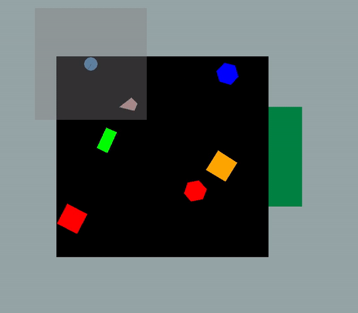

<<<<<<< HEAD
# BringBackShapes Environment
Codebase for the BringBackShapes (BBS) environment introduced in [Learning Robust Dynamics through Variational Sparse Gating](https://arnavkj1995.github.io/pubs/Jain22.pdf).


=======
# BringBackShapes
Codebase for BringBackShapes environment introduced in [Learning Robust Dynamics Through Variational Sparse Gating](https://github.com/arnavkj1995/VSG).
>>>>>>> 62b0b25b4127a061c6f9ec6962ad63dd34b63a8a

## Setup

```bash
conda env create -f env.yml
conda activate bringbackshapes
conda env update --file env.yml --prune
pip install -e .
```

<<<<<<< HEAD
To run a demo of the environment:
```bash
python demos/demo_2d_env.py
```

## Bibtex
If you find this code useful, please cite:

```
@InProceedings{Jain22,
    author    = "Jain, Arnav Kumar and Sujit, Shivakanth and Joshi, Shruti and Michalski, Vincent and Hafner, Danijar and Kahou, Samira Ebrahimi",
    title     = "Learning Robust Dynamics through Variational Sparse Gating",
    booktitle = {Advances in Neural Information Processing Systems},
    month     = {December},
    year      = {2022}
  }
```
=======
Make sure you have installed mujoco and mujoco_py. [Download](https://mujoco.org/download) and extract `mujoco210` into your `~/.mujoco` directory.

```bash
pip install 'mujoco-py<2.2,>=2.1'
export LD_LIBRARY_PATH=$LD_LIBRARY_PATH:~/.mujoco/mujoco210/bin
```

If you find this code useful, please reference in your paper:
```
@InProceedings{Jain22,
    author    = "Jain, A.~K. and Sujit, S. and Joshi, S. and Michalski, V. and Hafner, D. and Kahou, S.~E.",
    title     = "Learning Robust Dynamics through Variational Sparse Gating",
    booktitle = {Advances in Neural Information Processing Systems},
    month     = {December},
    year      = {2022}
  }
```
>>>>>>> 62b0b25b4127a061c6f9ec6962ad63dd34b63a8a
